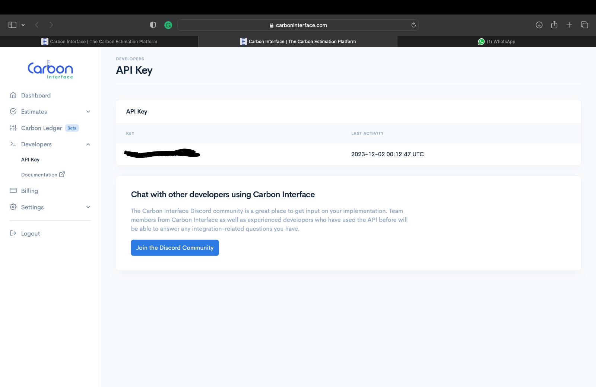
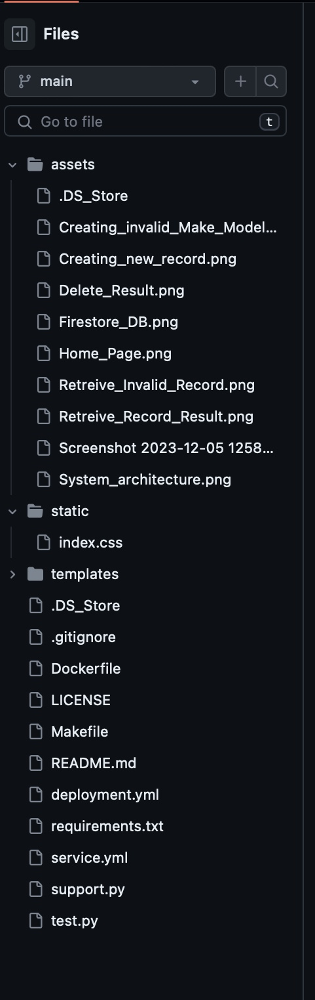
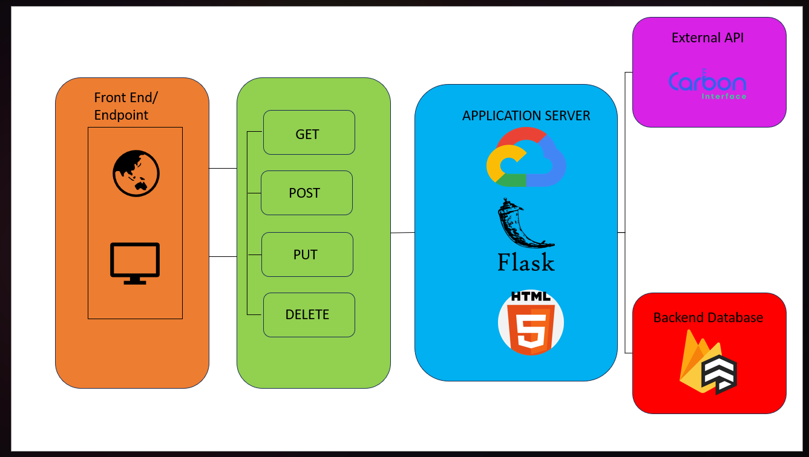
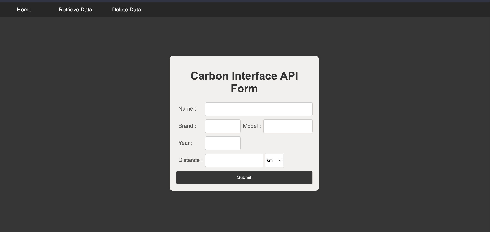
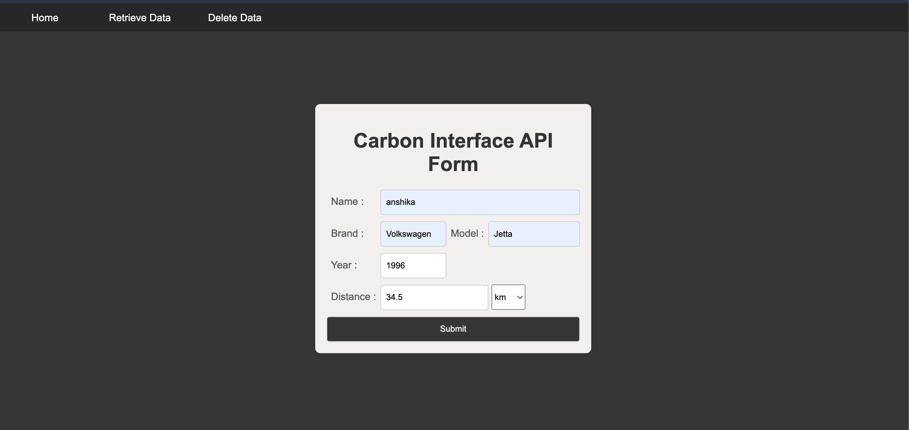
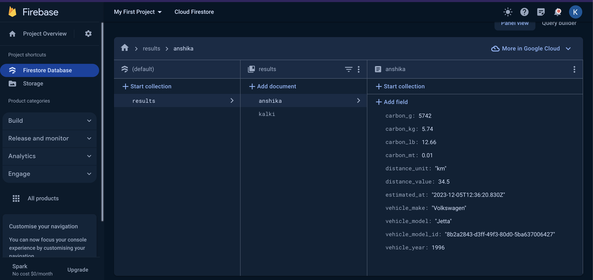
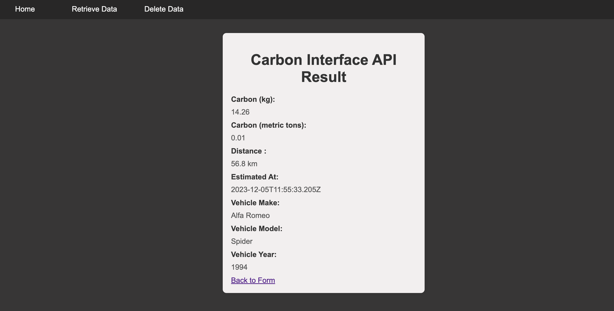
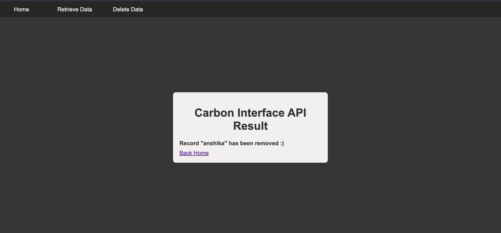

# Carbon Emission Estimator

## Table of Contents
- [About](#about)
- [Installation](#installation)
- [System Overview](#system-overview)
- [System Architecture](#system-architecture)
- [Application Overview](#application-overview)
- [Application Architecture](#application-architecture)
- [Cloud Infrastructure](#cloud-infrastructure)
    - [Google Cloud](#google-cloud)
    - [Cloud Firestore](#cloud-firestore)
- [Kubernetes](#kubernetes)
- [Docker](#docker)


## About 

In today's world, climate change has become a major problem, and it has been observed that carbon dioxide emissions are primarily responsible for worsening the climate change. Therefore it becomes crucial to reduce CO2 emissions. The Carbon Emission Estimator allow users to estimate and track carbon emissions generated by vehicles. It uses carbon interface api to provide estimates.


### Pre-requisites:

Some familiarity with the below mentioned concepts:
- [Python 3.10]
- [Google Cloud Platform]()
- [Cloud Firestore]()
- [Carbon Interface API]()
- [Kubernetes]()
- [Docker]()


## Installation

1. Clone the repository

	```sh
	git clone https://github.com/bipinKrishnan/cloud_computing_project.git
	```
2. Create virtual environment and install requirements with pip

	```sh
	python3 -m venv venv
	pip install -r requirements.txt
	```

3. Create Service Account on Google Cloud Console, we will need this service account json to setup and access Cloud Datastore. The account creation can be done by following the steps given in this [link](https://cloud.google.com/iam/docs/creating-managing-service-accounts).

	After creating the service account, download the service account json (sa.json) from console and move it to the application root directory. 

4. Create account on [Carbon Interface platform](https://www.carboninterface.com/), which is used for the carbon estimations and get the API KEY.

   

5. Export environment variables

	```sh
	source local_env.sh
	```
6. Run the application locally
	```sh
	python test.py
	```

### File Structure 
File Structure of the project is given below




### Run flask for development
```
$ python test.py
```


### Run with Docker

```
$ docker build -t carbon_app.

$ docker run -p 8000:8000 --name carbon_app carbon_app
 
```

## System Overview

The user interface provides an intuitive and responsive experience. It communicates with the backend services to retrieve and display carbon emission data. The backend is responsible for communicating with database and fetching and updating all the vehicle information. It also utilizes the Carbon Interface API to fetch emission factors and calculate carbon emissions.

## System Architecture



## Application Overview


### Main Page
This will be the main page, where user will input the details of the vehicle including name, brand, model, year, distance travelled





After submitting the information the results are displayed and stored in the forestore database

### Firestore Database Data Record



### Carbon Interface API Result



### Deleting a Record




## Application Architecture

### RESTful-API

A REST API (also known as RESTful API) is an application programming interface (API or web API) that conforms to the constraints of REST architectural style and allows for interaction with RESTful web services. REST stands for representational state transfer and was created by computer scientist Roy Fielding.
Specifically designed for Flask, Flask-RESTful is an extension that simplifies the rapid development of REST APIs. Acting as a lightweight abstraction, it seamlessly integrates with your existing Object-Relational Mapping (ORM) or libraries. Flask-RESTful promotes best practices and requires minimal setup, making it easily accessible for those already familiar with Flask.

### CRUD Operations 

CRUD stands for Create, Read, Update, and Delete. These are the fundamental operations that can be performed on data in a persistent storage system, such as a database

The four main HTTP methods that perform CRUD operations are as follows:

-   GET: Used to read/retrieve data from a web server and returns an HTTP status code of 200 (OK) if the data is successfully retrieved from the server.
-   PUT: Used to modify the data on the server. Replaces the entire content at a particular location with data that is passed in the body payload.
-   POST: Used to send data to the server. On successful creation, it returns an HTTP status code of 201.
-   DELETE: Used to delete the data on the server at a specified location.


### Step 1 — Creating the test.py file: This file is used for creation of the flask app and running of the application.
  -  Intializing the database and setting configuration values using firebase_admin 

  - Following routes have been added
      - [Home Page](/)   
      - [Fetch and Display Page](/fetch_and_display): Responsible for fetching carbon emission details of a vehicle 
      - [Fetch Landing Page](/fetch_landing)
      - [Result Page](/result) : Shows the actual results values obtained
      - [Delete Landing Page](/del_landing)
      - [Delete Page](/delete) : Given the username, it deletes the vehicle details from the database


### Step 2 — Creating the support.py file: This file is used for calling the Carbon Interface APIs.
  -  get_vehicle_make_id: Creating the function get the vehicle_make_id for a specified vehicle.
      This fucntion calls the GET https://www.carboninterface.com/api/v1/vehicle_makes API which returns an array of vehcile makes for a specified vehicle

      Request

      ```
        curl "https://www.carboninterface.com/api/v1/vehicle_makes"
          -H "Authorization: Bearer API_KEY"
          -H "Content-Type: application/json"
          -X GET
      ```

      Response

      ```
        [
          {
            "data": {
              "id": "4c1e16e1-7967-4394-b3cb-15f4577dffa1",
              "type": "vehicle_make",
              "attributes": {
                "name": "Ferrari",
                "number_of_models": 243
              }
            }
          }  
        ]
      
       ```
      
  - get_vehicle_models_id: Once we get the vehicle_make_ids we create a function to get the vehicle_model_id 
      This function calls the GET https://www.carboninterface.com/api/v1/vehicle_make/<vehicle_make_id>/vehicle_models which takes vehicle_make_id as a parameter       and returns all the vehicle model belonging to the vehicle make


      Request

      ```
        curl "https://www.carboninterface.com/api/v1/vehicle_makes/2b1d0cd5-59be-4010-83b3-b60c5e5342da/vehicle_models"
          -H "Authorization: Bearer API_KEY"
          -H "Content-Type: application/json"
          -X GET
      ```

      Response
    
      ```
        [
          {
            "data": {
              "id": "7268a9b7-17e8-4c8d-acca-57059252afe9",
              "type": "vehicle_model",
              "attributes": {
                "name": "Corolla",
                "year": 1993,
                "vehicle_make": "Toyota"
              }
            }
        }
      ]
    ```

  - fetch_vehicle_emission: Once the vehicle model for which the estimations are to be performed is identified we use the vehicle_model_id of that model and call     the vehicle estimator API.
      Request
      ```
        curl "https://www.carboninterface.com/api/v1/estimates"
          -H "Authorization: Bearer API_KEY"
          -H "Content-Type: application/json"
          -X POST
          -d {
            "type": "vehicle",
            "distance_unit": "mi",
            "distance_value": 100,
            "vehicle_model_id": "7268a9b7-17e8-4c8d-acca-57059252afe9"
          }
      ```
      Response
      ```
        {
          "data": {
            "id": "6108d711-be04-4dc4-93f9-43d969fd5273",
            "type": "estimate",
            "attributes": {
              "distance_value": 100.0,
              "vehicle_make": "Toyota",
              "vehicle_model": "Corolla",
              "vehicle_year": 1993,
              "vehicle_model_id": "7268a9b7-17e8-4c8d-acca-57059252afe9",
              "distance_unit": "mi",
              "estimated_at": "2021-01-10T15:24:32.568Z",
              "carbon_g": 37029,
              "carbon_lb": 81.64,
              "carbon_kg": 37.03,
              "carbon_mt": 0.04
            }
          }
      }
    ```
### External APIs Used

#### Carbon Interface API

The Carbon Interface API provides details on the activity that is emitting carbon. The estimates API uses the most accurate estimation methodology to get the CO2 emissions.

## Cloud Infrastructure

Cloud infrastructure peforms similar to a traditional physical infrastructure but it also offers benefits such as reduced ownership costs, heightened flexibility, and scalability.

Cloud computing is commonly categorized into three service models:

-Infrastructure as a Service (IaaS): Provides virtualized computing resources over the internet. Users can rent virtual machines, storage, and networks.

-Platform as a Service (PaaS): Offers a platform allowing customers to develop, run, and manage applications without dealing with the complexities of infrastructure.

-Software as a Service (SaaS): Delivers software applications over the internet on a subscription basis. Users can access the software without worrying about the underlying infrastructure.

### Google Cloud

GCP provides customers with highly specialized services in three key domains: big data, machine learning, and analytics. It boasts robust scalability, stable load balancing, and renowned low response times. Notably, Google's container offering stands out, providing users a significant advantage, as it originated the Kubernetes standard, now widely adopted by competitors AWS and Azure.

#### Cloud Firestore

Cloud Firestore is a NoSQL document database that simplifies storing, syncing, and querying data for your mobile and web apps at global scale. Its client libraries provide live synchronization and offline support, while its security features and integrations with the Firebase and Google Cloud platforms accelerate building truly serverless apps


Firestore features include:

-   **Serverless**. Fully managed, serverless database that effortlessly scales up or down to meet any demand, with no maintenance windows or downtime.
-   **Powerful Query Engine**. Firestore allows you to run sophisticated ACID transactions against your document data. This gives you more flexibility in the way you structure your data.
-   **Security**. Firestore seamlessly integrates with Firebase Authentication and Identity Platform, to enable customizable identity-based security access controls and enables data validation via a configuration language.
-   **Datastore mode**. Firestore supports the Datastore API. You won't need to make any changes to your existing Datastore apps, and you can expect the same performance characteristics and pricing with the added benefit of strong consistency.

### Kubernetes

Kubernetes, also known as K8s, is an open-source system for automating deployment, scaling, and management of containerized applications. It serves as a system designed to execute and coordinate containerized applications across a cluster of machines. Functioning as a comprehensive platform, it oversees the entire life cycle of containerized applications and services, employing methods that ensure predictability, scalability, and high availability.

**service.yaml** contains Kubernetes load-balancer configuration for the project.

```yaml
apiVersion: v1
kind: Service
metadata:
  name: app-load-balancer
spec:
  type: LoadBalancer
  selector:
    app: carb-app
  ports:
    - port: 8000	  
 ```

**deployment.yaml** contains Kubernetes nodes and replicas configuration for the project.

```
apiVersion: apps/v1
kind: Deployment
metadata:
  name: carbon-app
  labels:
    app: carb-app
spec:
  replicas: 3
  selector:
    matchLabels:
      app: carb-app
  template:
    metadata:
      labels:
        app: carb-app
    spec:
      containers:
      - name: carbon-app-image
        image: gcr.io/burnished-flare-400911/carbon-app-image
        ports:
        - containerPort: 8000
  ```

### Docker

Docker is an open platform for developing, shipping, and running applications. Docker enables you to separate your applications from your infrastructure so you can deliver software quickly. With Docker, you can manage your infrastructure in the same ways you manage your applications. By taking advantage of Docker's methodologies for shipping, testing, and deploying code, you can significantly reduce the delay between writing code and running it in production.


